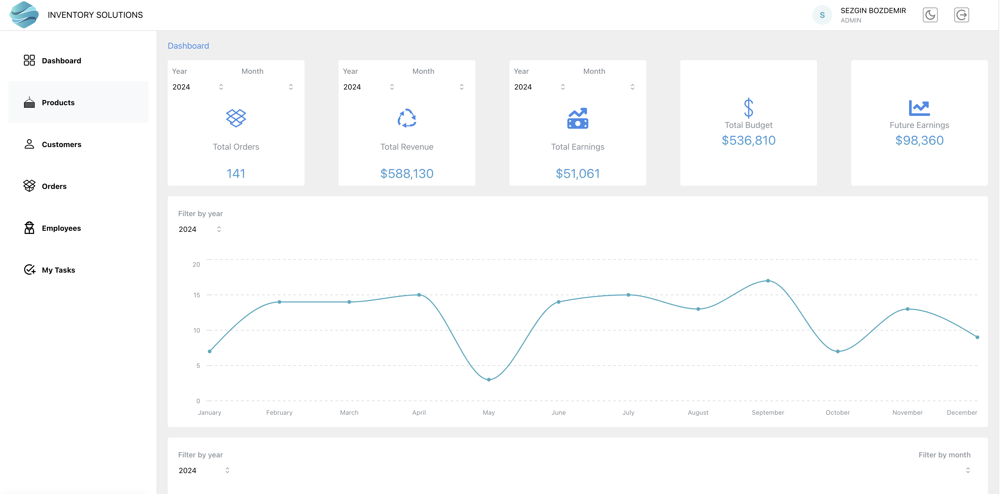
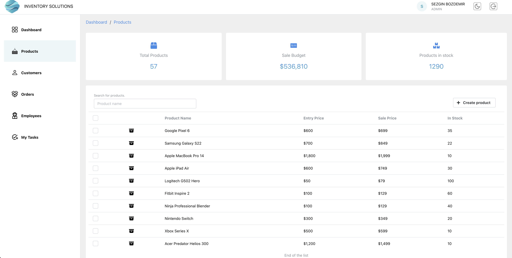

# Inventory Management Application

This is a full-stack inventory management application built with the following technologies:

- **Frontend:** React (with TypeScript), Mantine UI, Tailwind CSS
- **State Management:** Redux
- **Backend:** Node.js, Express
- **Database:** MongoDB
- **Authentication:** JWT (JSON Web Token)

##Screenshots





## Features

- Manage product and customer lists
  - Add, edit, or delete products and customers.
- Create and list orders.
- Manage employee tasks:
  - List employees.
  - Assign tasks to employees (Admin feature).
- Secure login system with JWT authentication.

## Installation

1. **Clone the repository**:

   ```bash
   git clone https://https://github.com/sezginbozdemir/inventory-solutions
   cd inventory-solutions
   ```

2. **Install frontend dependencies**:

   ```bash
   cd client
   npm install
   ```

   **Install backend dependencies**:

   ```bash
   cd server
   npm install
   ```

3. **Create .env file for client**

   ```bash
   VITE_API_ROUTE=http://localhost:8000/api
   ```

   **Create .env file for server**

   ```bash
   MONGO_URL=your_mongodb_connection_string
   JWT_SECRET=your_jwt_secret
   ```

4. **Start the frontend**:

   ```bash
   cd client
   npm run dev

   ```

   **Start the frontend**:

```bash
   cd server
   npm run dev

```

The app will run on [http://localhost:3000](http://localhost:3000).
